# TP1 
## Exercie 1 : Installation de Docker et vérification de l’environnement

**Question 1.a** : Installation de docker 

**Question 1.b** :  

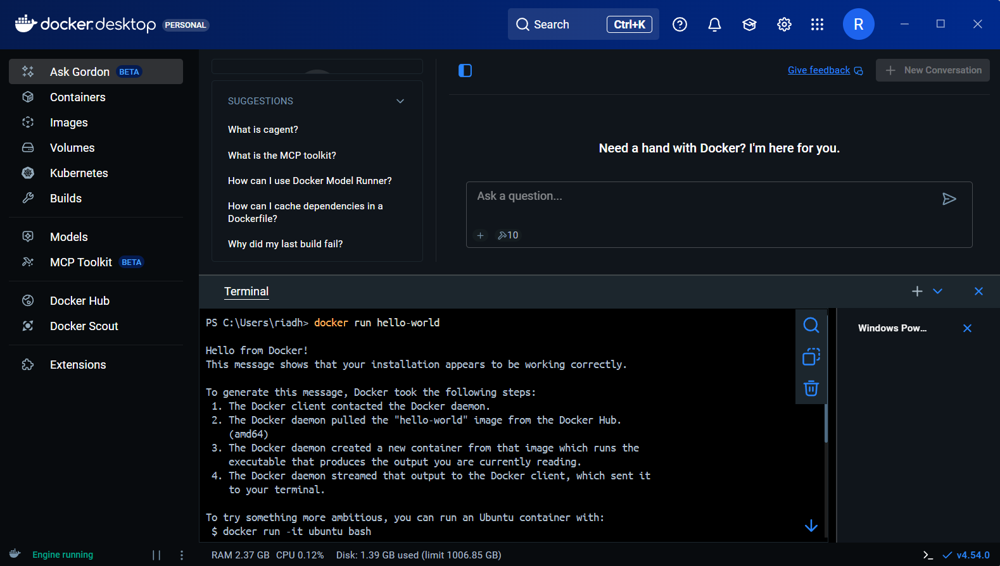

**Question 1.c** : 

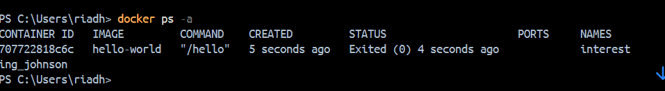

La commande docker **ps -a** affiche la liste de tous les conteneurs présents sur ma machine, qu’ils soient en cours d’exécution ou arrêtés.

## Exercice 2 : Premiers pas avec Docker : images et conteneurs

**Question 2.a** :

Une image Docker est un modèle figé qui contient tout l’environnement nécessaire pour exécuter une application et un conteneur Docker est une instance d’image en cours d’exécution ou arrêtée. 

**Question 2.b** :

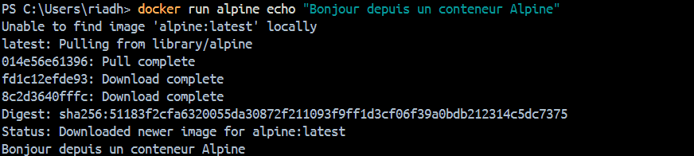

Cette commande télécharge l’image **alpine** puis crée un conteneur basé sur cette image. À l’intérieur du conteneur, la commande **echo** est exécutée et le message s’affiche dans le terminal.

**Question 2.c** :

Le conteneur alpine a le statut Exited. Cela s’explique par le fait que ce conteneur n’exécutait qu’une seule commande (echo). Une fois cette commande terminée, le processus principal s’arrête et le conteneur n’a plus rien à faire et docker le marque donc comme Exited.

**Question 2.d** :

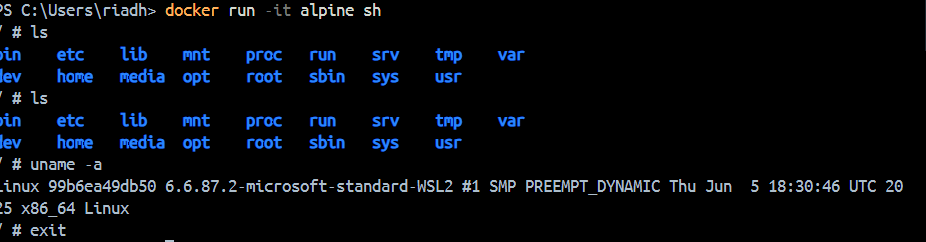

Avec cette commande, je démarre un conteneur basé sur l’image alpine en mode interactif, avec un sh. Dans le conteneur, la commande **ls** affiche la structure de fichiers du conteneur.

La commande **uname -a** affiche les informations du système (noyau Linux, architecture)et la commande **exit** quitte le shell et entraîne l’arrêt du conteneur.

## Exercice 3 : Construire une première image Docker avec une mini-API FastAPI

### Etape 1 : Compléter le fichier app.py

**Question 3.a** :

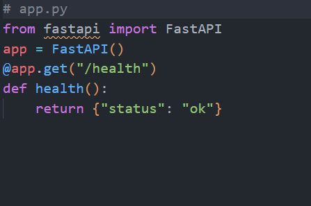

### Etape 2 : Compléter le Dockerfile

**Question 3.b** : Fichier Dockerfile

(Dockerfile)

FROM python:3.11-slim

WORKDIR /app

COPY app.py /app/app.py

RUN pip install fastapi uvicorn

CMD ["uvicorn", "app:app", "--host", "0.0.0.0", "--port", "8000"]

### Etape 3 : Construire l'image Docker

**Question 3.c** : Construire image docker

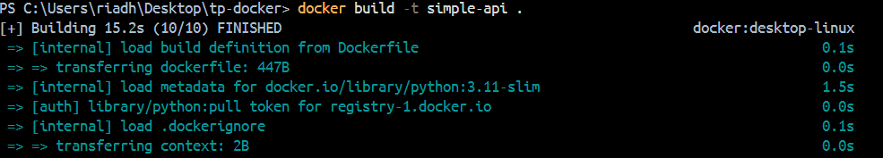

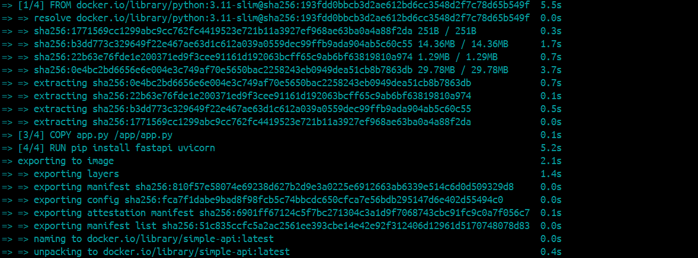

L’image Docker a été construite correctement comme c'est montré dans ses deux captures.

## Exercice 4 : Exécuter l’API FastAPI dans un conteneur Docker

### Etape 1 : Lancer le conteneur

**Question 4.a** : 

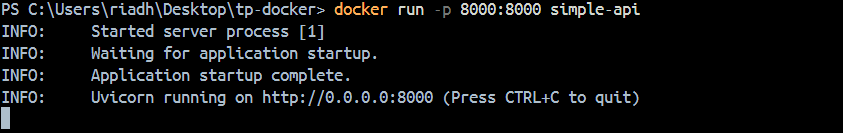

La commande **docker run -p 8000:8000 simple-api** lance un conteneur à partir de l’image simple-api et publie le service web.

L’option **-p 8000:8000** crée une redirection de port : le premier 8000 correspond au port utilisé sur host , et le deuxième 8000 correspond au port exposé à l’intérieur du conteneur.

### Etape 2 : Tester l’endpoint /health

**Question 4.b** : 

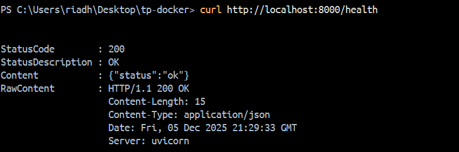

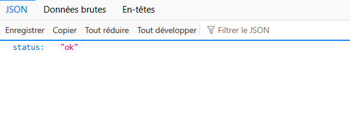

Pour tester l’endpoint, j’ai  lancé le conteneur avec la commande :
docker run -p 8000:8000 simple-api
Dans un second terminal, j’ai exécuté : **curl http://localhost:8000/health**
La réponse obtenue est :
{"status":"ok"}, ce qui correspond exactement au comportement défini dans le fichier app.py.

### Etape 3 : Observer les conteneurs en cours d’exécution

**Question 4.c** : 

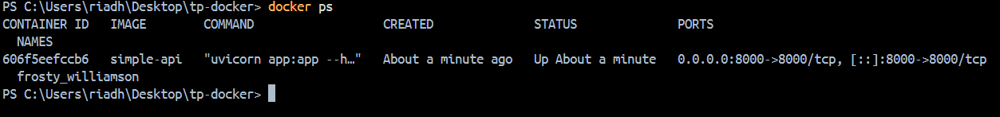

**docker ps** identifie le conteneur correspondant à l’image simple-api.

Nom du conteneur : frosty_williamson

Image utilisée : simple-api

Port mappé : 0.0.0.0:8000

### Etape 4 : Arrêter le conteneur

**Question 4.d** : 

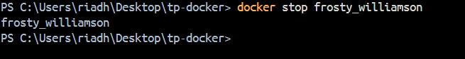

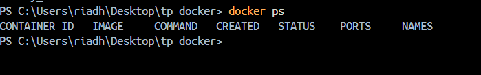

J’ai arrêté le conteneur en utilisant la commande :
**docker stop frosty_williamson**
Après cela, la commande **docker ps** n’affiche plus le conteneur, puisqu’elle ne liste que les conteneurs actuellement en cours d’exécution.
En revanche, la commande **docker ps -a** affiche toujours le conteneur avec le statut Exited, car cette commande liste tous les conteneurs, qu’ils soient actifs ou arrêtés.

Cela montre que Docker conserve l’historique des conteneurs arrêtés tant qu’ils ne sont pas supprimés.

## Exercice 5 : Démarrer un mini-système multi-conteneurs avec Docker Compose

### Etape 1 : Préparer la structure des fichiers

### Etape 2 :Compléter le fichier docker-compose.yml

**Question 5.b** : 

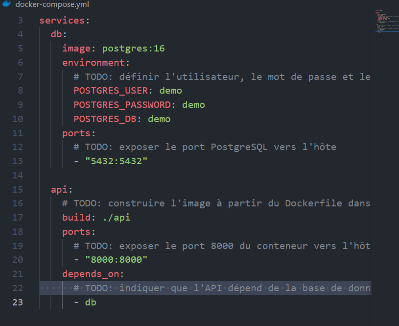

### Etape 3 — Démarrer la stack avec Docker Compose

**Question 5.c** : 

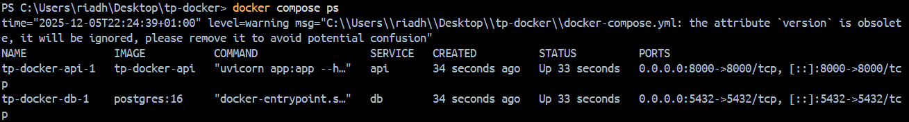

J’ai démarré les services de docker-compose.yml : **docker compose up -d**

Cette commande lance en arrière-plan les deux services :

db basé sur l’image postgres:16

api construit à partir du Dockerfile du dossier api/.

Ainsi j'ai vérifié que les deux services sont bien en état Up, avec les ports exposés :

5432 pour PostgreSQL et 8000 pour l’API FastAPI.

### Etape 4 — Tester à nouveau l’endpoint /health

**Question 5.d** : 

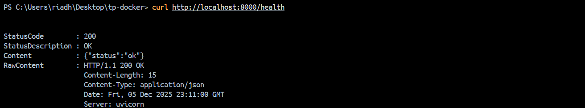

La réponse obtenue est {"status":"ok"}, ce qui confirme que l’API FastAPI est correctement déployée lorsque le système est lancé via Docker Compose.

### Etape 5 — Arrêter proprement les services

**Question 5.e** : 

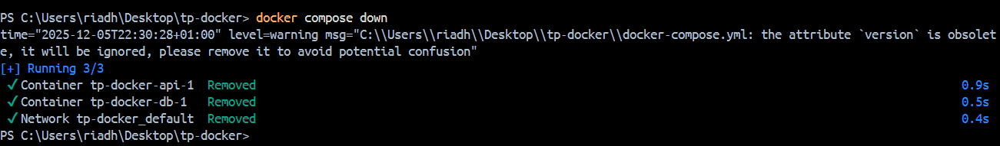

La commande **docker compose down** permet d’arrêter et de supprimer tous les conteneurs créés par Docker Compose à partir du fichier

docker-compose.yml. 

Elle supprime le réseau associé à ces services. 

**docker stop <frosty_williamson>** ne concerne qu’un conteneur individuel. Elle se contente d’arrêter son exécution, mais le conteneur 

reste présent sur la machine, Ca ne supprime pas les ressources associées et n’agit pas sur les autres services.

## Exercice 6 : Interagir avec la base de données PostgreSQL dans un conteneur

### Etape 1 — Se connecter au conteneur PostgreSQL

**Question 6.a** : 

 L’option **exec** sert à exécuter une commande dans un service existant, **db** est le nom du service PostgreSQL défini dans Docker Compose, **-U** précise l’utilisateur PostgreSQL à utiliser et **-d** indique le nom de la base de données à laquelle se connecter.

 ### Etape 2 — Exécuter quelques commandes SQL simples

**Question 6.b** : 

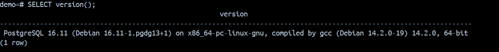

**SELECT version();** renvoie la version de PostgreSQL utilisée dans le conteneur : **PostgreSQL 16.11**

**SELECT current_database();** renvoie le nom de la base actuellement utilisée : **demo**

### Etape 3 — Comprendre la connexion depuis d'autres services

**Question 6.c** :

Dans un environnement Docker Compose, les services définis dans le même fichier partagent automatiquement un réseau interne. Un service 

peut donc se connecter à la base PostgreSQL en utilisant le nom du service comme hostname.

Dans notre cas(API FastAPI) :

**Hostname** : db 

**Port** : 5432 

**Utilisateur** : demo

**Mot de passe** : demo

**Base de données** : demo

### Etape 4 — Nettoyer

**Question 6.d** :

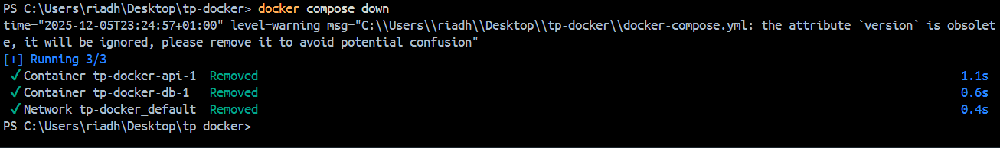

**docker compose down** arrête et supprime les conteneurs ainsi que le réseau créés par Docker Compose, mais conserve les volumes et donc les données persistantes.

**docker compose down -v** supprime également les volumes associés aux services. L’option -v entraîne donc la suppression définitive des données stockées dans ces volumes. 

## Exercice 7 : Déboguer des conteneurs Docker : commandes essentielles et bonnes pratiques

### Etape 1 — Afficher les logs d’un service

**Question 7.a** :

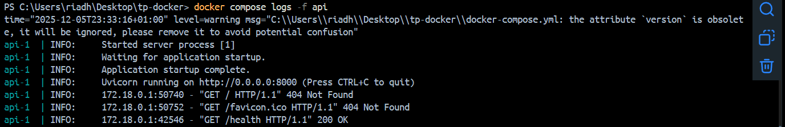

Pour déboguer l’API, j’ai affiché les logs du service avec la commande :

**docker compose logs -f api**

Au démarrage, les logs montrent que le serveur Uvicorn se lance correctement.

Lorsque j’appelle /health (via curl http://localhost:8000/health), une nouvelle ligne apparaît dans les logs, du type :

GET /health HTTP/1.1" 200 OK,

ce qui confirme que la requête est bien reçue par l’API et que la réponse est retournée avec le code HTTP 200.

### Etape 2 — Entrer dans un conteneur en cours d’exécution

**Question 7.b** :

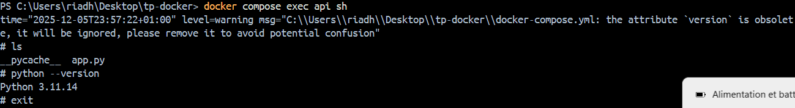

**ls** : affiche le fichier app.py, ce qui confirme que le code de l’API a bien été copié dans le conteneur.

**python --version** :affiche Python 3.11.14, ce qui correspond à l’image de base python:3.11-slim.

**exit** : permet de quitter le shell du conteneur.

### Etape 3 — Redémarrer un service

**Question 7.c** :

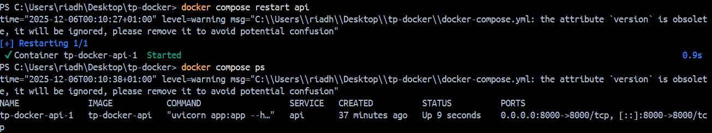

J’ai redémarré uniquement le service d’API avec la commande :

**docker compose restart api**

Cette commande arrête puis relance le conteneur correspondant au service api, sans toucher aux autres services.

Après le redémarrage, j’ai vérifié que l’endpoint **http://localhost:8000/health** répond toujours {"status":"ok"}, ce qui confirme que 

l’API a redémarré correctement.

Un redémarrage de service est particulièrement utile lorsque l’API se bloque ou lorsque l’on modifie sa configuration ou son 

environnement sans vouloir arrêter toute la stack Docker Compose.

### Etape 4 — Conteneur qui ne démarre pas : diagnostic

**Question 7.d** :

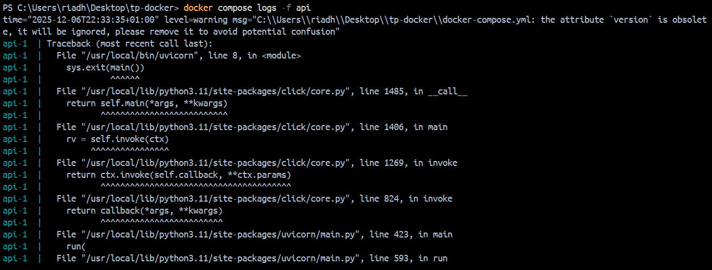

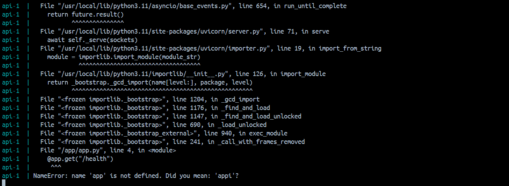

Pour simuler un problème, j’ai modifié le fichier app.py en remplaçant l’objet **app = FastAPI()** par **appi = FastAPI()**.

L’image Docker a ensuite été reconstruite puis la stack relancée avec :

**docker compose up -d --build**

L’API ne démarrait plus correctement.

Pour comprendre la cause, j’ai affiché les logs du service avec :

**docker compose logs -f api**

Les logs indiquaient une erreur du type :
“AttributeError: module 'app' has no attribute 'app'” ou “Error loading ASGI app. Could not import module 'app'”.

Ce message montre qu’Uvicorn essaie de charger l’application via la commande uvicorn app:app, c’est-à-dire qu’il s’attend à trouver un 

objet app dans le module app.py. Comme j’avais renommé l’objet en appi, l’attribut app n’existait plus, ce qui empêche l’API de démarrer.

En corrigeant le fichier pour remettre app = FastAPI(), puis en reconstruisant l’image et en relançant docker compose up -d --build, 

l’API redémarre normalement.

### Etape 5 — Supprimer des conteneurs et images

**Question 7.e** :

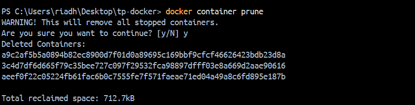

**docker container prune** et **docker image prune** permettent de nettoyer l’environnement Docker en supprimant les conteneurs arrêtés 

et les images inutilisées.

Il est important de les utiliser régulièrement, car chaque conteneur et chaque image occupe de l’espace disque. 

Le nettoyage régulier permet :

de libérer de l’espace disque,

de garder une liste de conteneurs et d’images plus lisible,

de réduire les risques de confusion entre anciennes et nouvelles versions d’images,

et d’éviter des problèmes de saturation ou de lenteur sur des environnements de développement ou de production.

## Exercice 8 : Questions de réflexion

**Question 8.a** :

Un notebook Jupyter n’est pas adapté pour la production car il n’assure ni une bonne reproductibilité (ordre des cellules, état du 

kernel, dépendance à la machine locale) ni un environnement maîtrisé et stable. Il est conçu pour l’exploration interactive, pas pour 

faire tourner en continu une API fiable exposant un modèle, intégrée à d’autres services comme une base de données. Pour cela, on préfère 

une API conteneurisée avec Docker, qui garantit un environnement fixe et déployable partout.

**Question 8.b** :

Docker Compose est essentiel dès qu’on manipule plusieurs services (API, base de données), car il permet de décrire toute 

l’architecture dans un seul fichier docker-compose.yml et de lancer ou arrêter l’ensemble avec une seule commande. Il gère 

automatiquement le réseau entre services par exemple (l’API qui accède à PostgreSQL via le hostname db) et garantit une stack facilement 

reproductible. Cela simplifie fortement le déploiement, les tests et le débogage d’un système multi-services.