# TP2 — Pipeline d’ingestion de données

## Exercice 1 : Mise en place du projet et du rapport
## Exercice 1 : Base de données et docker-compose

**Question 1.b**

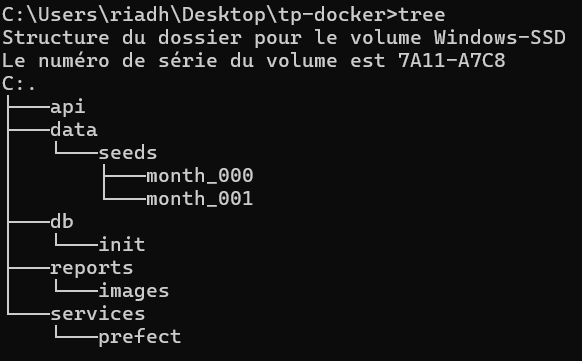

**Question 1.c**

### Structure des données

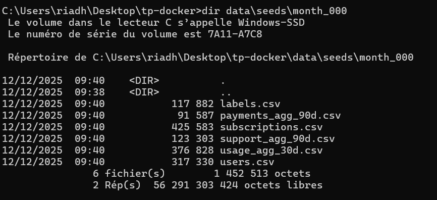

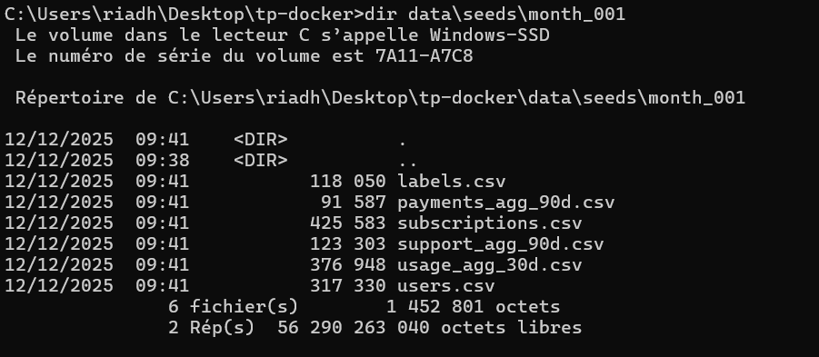

## Exercice 2 : Base de données et docker-compose
**Question 2.a**

Le shéma a été crée 

**Question 2.b**

Le fichier `.env` contient les variables d’environnement de configuration de la base PostgreSQL.

Dans un projet Docker, ce fichier permet de séparer la configuration du code, les conteneurs lisent ces valeurs au démarrage, ce qui évite de mettre des mots de passe ou paramètres sensibles en dur dans les Dockerfile ou dans le code applicatif.

**Question 2.c**

Extrait du fichier `docker-compose.yml` :

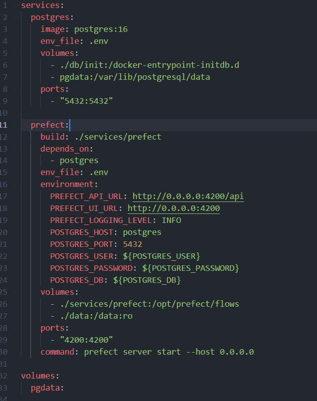

**Question 2.d**

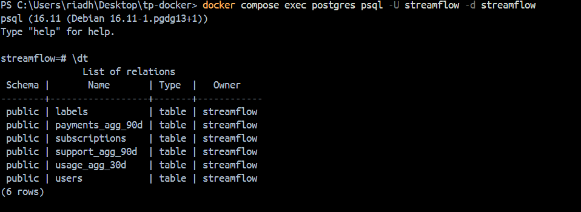

- **users** : contient les informations de base sur les utilisateurs .
- **subscriptions** : décrit l’abonnement de chaque utilisateur .
- **usage_agg_30d** : mesures d’utilisation du service sur 30 jours .
- **payments_agg_90d** : informations sur les paiements et échecs de paiement sur 90 jours.
- **support_agg_90d** : tickets de support et temps de résolution sur les 90 derniers jours.
- **labels** : contient la variable cible  pour les futures tâches de machine learning.

## Exercice 3 :Upsert des CSV avec Prefect (month_000)

**Question 3.a**

Le dossier `services/prefect` contient un Dockerfile basé sur l’image `prefect` et un fichier `requirements.txt` avec les dépendances nécessaires (Prefect, SQLAlchemy, psycopg ..).  
Le conteneur `prefect` joue le rôle **d’orchestrateur du pipeline d’ingestion** dont il héberge le serveur Prefect et un worker qui exécuteront les flows (tâches d’ingestion, validation et écriture en base) vers PostgreSQL. C’est ce service qui coordonnera les différentes étapes du pipeline (lecture des CSV, contrôle qualité, upsert en base, snapshots mensuels).

**Question 3.b**

`upsert_csv` lit un fichier CSV , ajuste certains types (dates, booléens), puis utilise SQLAlchemy pour écrire les données dans PostgreSQL avec une stratégie d’upsert.  
Pour chaque table, elle crée d’abord une table temporaire `tmp_<table>` dans laquelle le CSV est chargé en bloc. Ensuite, elle exécute une requête :

- `INSERT INTO <table> (...) SELECT ... FROM tmp`
- avec `ON CONFLICT (clé_primaires) DO UPDATE SET col = EXCLUDED.col` pour toutes les colonnes non clés.

**Question 3.c**

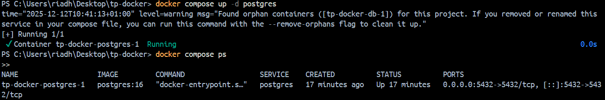

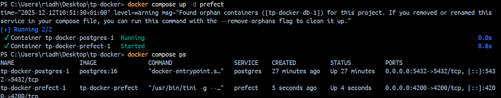

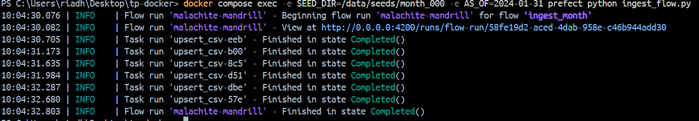

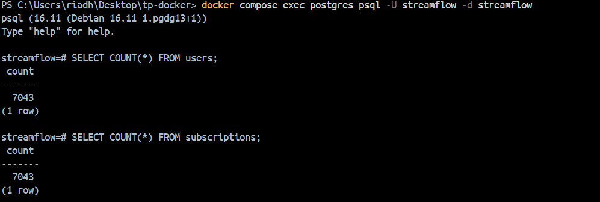

**users** = 7043
**subscriptions** = 7043

## Exercice 4 : Validation des données avec Great Expectations

**Question 4.a**

**validate_with_ge** ajoute une étape de contrôle qualité dans le pipeline d’ingestion à l’aide de Great Expectations.  
Elle charge un échantillon des données depuis PostgreSQL, vérifie la conformité du schéma (colonnes attendues) et applique des règles simples de cohérence métier, comme la non-négativité des agrégats d’usage.  

**Question 4.b**

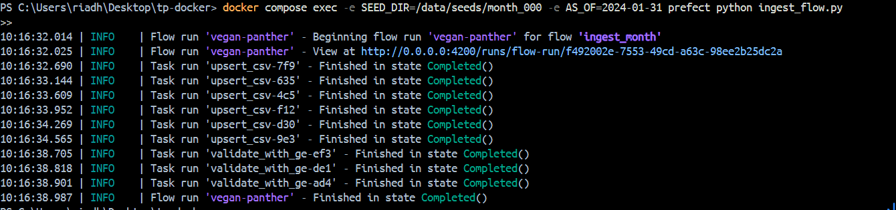

**Question 4.c**

 Validation des données avec Great Expectations

Dans le pipeline d’ingestion, des règles de validation ont été ajoutées sur la table `usage_agg_30d` afin de contrôler la cohérence des agrégats d’usage avant toute étape aval.

Exemples d’expectations appliquées :

gdf.expect_column_values_to_be_between("watch_hours_30d", min_value=0)
gdf.expect_column_values_to_be_between("avg_session_mins_7d", min_value=0)

Ces bornes ont été choisies car les métriques concernées représentent des durées ou des volumes d’utilisation. Il est impossible, d’un point de vue métier, d’avoir un nombre d’heures de visionnage ou une durée moyenne de session négatifs. Des valeurs négatives indiqueraient une erreur de calcul, un export de données corrompu ou un problème lors de l’agrégation.

Ces règles de validation protègent le futur modèle de machine learning en empêchant l’ingestion de données incohérentes ou physiquement impossibles. Elles permettent de détecter les anomalies en amont et d’éviter qu’un modèle soit entraîné ou utilisé sur des données erronées, ce qui pourrait biaiser les prédictions et dégrader les performances.

## Exercice 5 : Snapshots et ingestion month_001

**Question 5.a**

La fonction `snapshot_month(as_of)` permet de figer l’état des données à la fin d’un mois donné.  
Elle crée, si nécessaire, des tables de snapshots dédiées (`*_snapshots`) et y insère les données courantes des tables live en leur associant une date `as_of`.

Le champ `as_of` représente la frontière temporelle du snapshot (par exemple la fin du mois). Il permet de conserver l’historique des données mois par mois, même si les tables live évoluent ensuite.

L’utilisation de `ON CONFLICT (user_id, as_of) DO NOTHING` rend l’opération idempotente : relancer le pipeline pour un même mois ne duplique pas les données déjà snapshotées.

**Question 5.b**

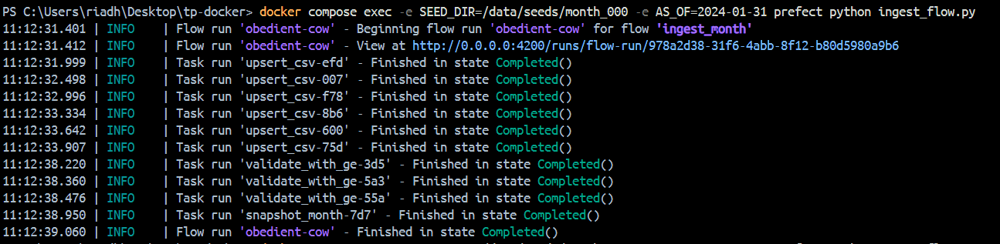

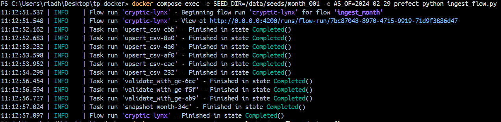

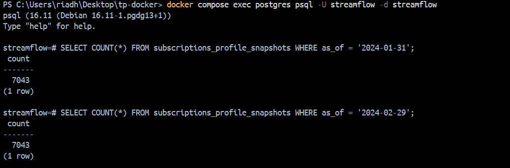

Les deux snapshots contiennent le même nombre de lignes (7043 pour `2024-01-31` et 7043 pour `2024-02-29`).  
Cela s’explique par le fait que le nombre d’utilisateurs n’a pas changé entre `month_000` et `month_001`. Chaque snapshot contient une ligne par utilisateur et par date `as_of`, ce qui permet de conserver l’historique des valeurs mensuelles même lorsque les profils évoluent dans le temps.

**Question 5.c**

### Pipeline complet

CSV (month_000 / month_001) -->Prefect flow (ingest_month) --> Upsert CSV -> Tables live (Postgres)--> Great Expectations (validation)-->Snapshots (as_of)-->Tables *_snapshots (user_id, as_of)

### Tables live

Les tables live représentent l’état **courant** des données et évoluent en permanence au fil des ingestions mensuelles. Travailler directement sur ces tables pour 

entraîner un modèle poserait plusieurs problèmes dont les données pourraient changer, rendant les résultats non reproductibles, et des informations futures pourraient

involontairement être utilisées pour prédire le passé.  

Donc pour un système de machine learning fiable, il est indispensable de figer les données utilisées pour l’entraînement.

### Snapshots

Les snapshots permettent de capturer l’état exact des données à une date donnée `as_of`.  

Ils évitent le data leakage, car le modèle n’a accès qu’aux informations disponibles à la date considérée, et non à des valeurs mises à jour ultérieurement et ils 

garantissent la reproductibilité temporelle.

### Réflexion personnelle

La partie la plus difficile dans ce TP a été le lancement du service Prefect ou  le conteneur ne démarrait pas correctement au début et l’interface Prefect n’était pas présente.  
Alors j’ai modifié le fichier `docker-compose.yml` en ajoutant dux lignes dans dans le service prefect : (ports:- "4200:4200" et command: prefect server start --host 0.0.0.0)