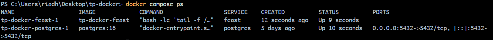
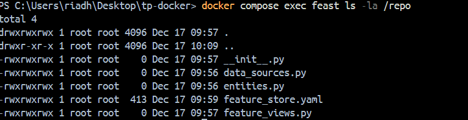
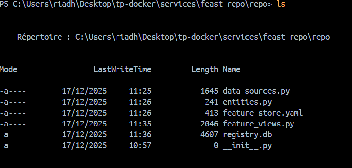
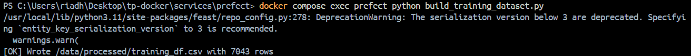
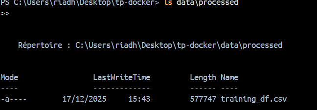
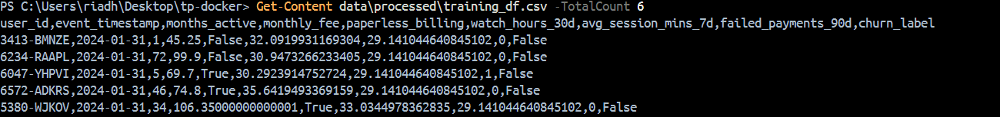
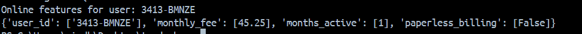
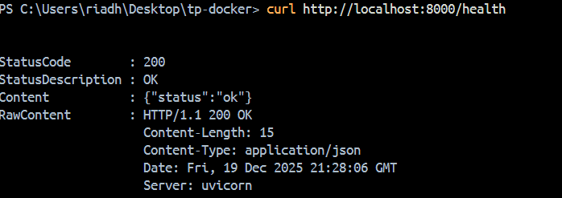
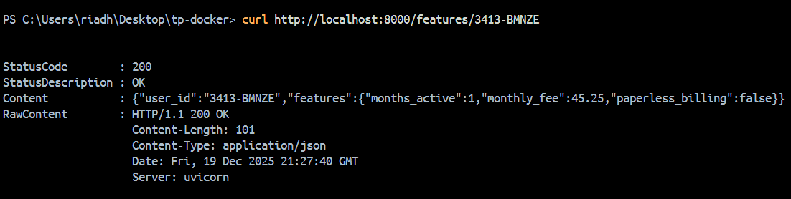
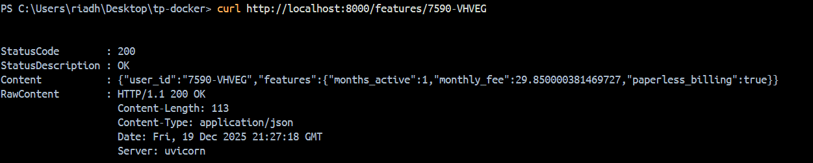

# Contexte

Dans les TP précédents, nous avons mis en place un pipeline d’ingestion complet pour le projet StreamFlow. Les données sont stockées dans PostgreSQL sous forme de 

tables live et de snapshots mensuels as_of pour deux périodes (month_000 et month_001).

Ces données couvrent les informations utilisateurs, les abonnements, l’usage du service, les paiements et le support client.

L’objectif du TP3 est de connecter ces données à un Feature Store à l’aide de Feast, afin de définir et gérer des features de manière centralisée. 

Nous chercherons à récupérer ces features aussi bien en mode offline pour le train du modèle qu’en mode online pour l’inférence et à exposer un endpoint API simple 

consommant ces features dans le cadre d’un système de machine learning en production.

# Mise en place de Feast

Commande utilisée pour construire les images et démarrer les services en arrière-plan : **docker compose up -d --build**

Le conteneur feast sert à exécuter Feast dans un environnement reproductible, connecté au même PostgreSQL que le reste de l’architecture.

La configuration du Feature Store se trouve dans le conteneur dans le dossier /repo notamment le fichier feature_store.yaml.

J'ai utulisé ce conteneur via  docker compose exec feast pour appliquer la définition du Feature Store (feast apply) et matérialiser les features dans l’online store.

# Définition du Feature Store

Dans Feast, une Entity représente un objet métier (un utilisateur, un produit) sur lequel on calcule des features. Elle sert de référence commune 

pour joindre les features issues de différentes sources.

Dans StreamFlow, user_id est un excellent choix de clé de jointure car il identifie un client de manière unique et est présent dans toutes les tables (abonnements, 

usage ..). Cela permet de relier  les features entre elles et de récupérer un vecteur de features cohérent pour un utilisateur donné.

Une table de snapshot utilisée comme source de features est **usage_agg_30d_snapshots**

Elle contient les colonnes de features suivantes : watch_hours_30d, avg_session_mins_7d, unique_devices_30d, rebuffer_events_7d 

**feast apply** enregistre la définition du Feature Store (entities, sources et feature views) dans le registre Feast et màj le fichier registry.db 

# Récupération offline & online

**docker compose exec prefect python build_training_dataset.py** : lance le script build_training_dataset.py à l’intérieur du conteneur prefect pour 

récupèrer les features via Feast puis écrit le fichier training_df.csv dans /data/processed .

**ls data\processed**: liste le contenu du dossier data/processed pour confirmer que training_df.csv existe après l’exécution du script.

**Get-Content data\processed\training_df.csv -TotalCount 6**: affiche les 5 premières lignes de données de training_df.csv + en-tête.

Feast garantit la cohérence temporelle lors de la récupération offline en utilisant le champ **timestamp_field = "as_of"** défini dans les DataSources qui représente 

la date à laquelle les features sont valides. 

Lors de l’appel de get_historical_features => Feast ne sélectionne que les valeurs de features dont le timestamp est antérieur ou égal à event_timestamp fourni dans 

entity_df.

La structure (user_id, event_timestamp) permet ainsi d’associer chaque utilisateur uniquement aux informations disponibles à la date considérée en évitant toute fuite 

de données futures

Si le user_id est interrogé alors qu’aucune feature n’a été matérialisée pour lui donc Feast retourne des valeurs nulles pour les features en indiquant qu’aucune 

information n’est disponible dans l’Online Store pour ce user.

**/health**

**3413-BMNZE**

**7590-VHVEG**

# Réflexion

**/features/{user_id}** réduit le training-serving skew car il sert les features depuis le même Feature store et avec les mêmes Feature Views que celles utilisées 

pour construire le dataset d’entraînement 'offline'. 

On évite  de recoder différemment les features côté API ce qui limite les écarts de logique ou de sources entre train et prod.

De plus, la matérialisation dans l’online store garantit des valeurs cohérentes et disponibles en temps réel et alignées avec les snapshots historiques utilisés pour
  
l’apprentissage.
