# Exercie 1 : Démarrer la stack pour l'observabilité

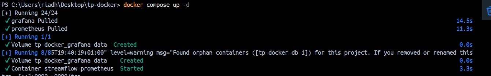

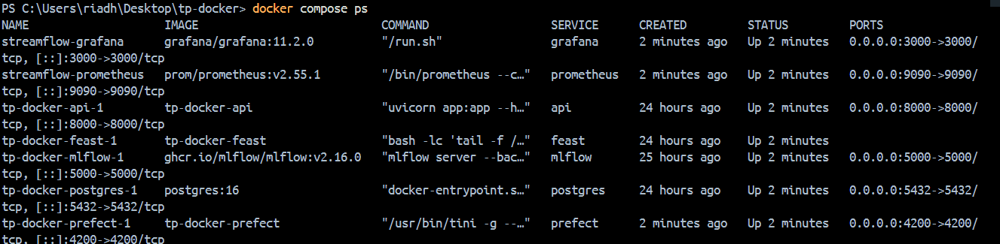

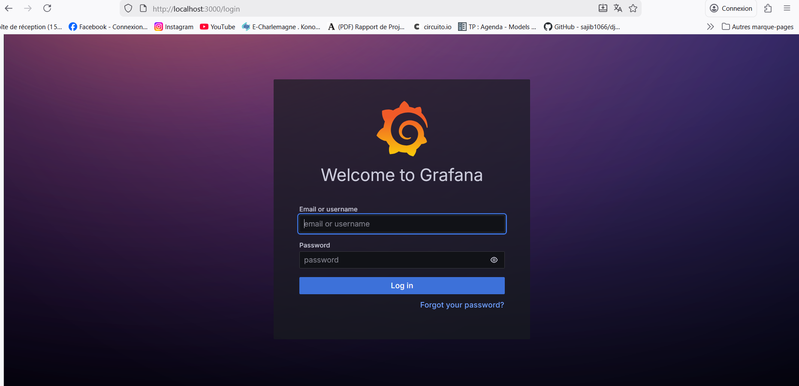

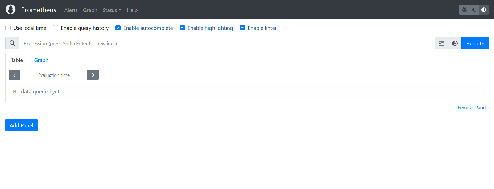

Parce que Prometheus tourne dans un conteneur Docker :

- localhost depuis Prometheus = le conteneur Prometheus lui-même, pas ta machine.

- api:8000 fonctionne car api est le nom du service Docker Compose, résolu via le réseau interne Docker vers le conteneur de l’API.

# Exercice 2 : Instrumentation de FastAPI avec de métriques Prometheus

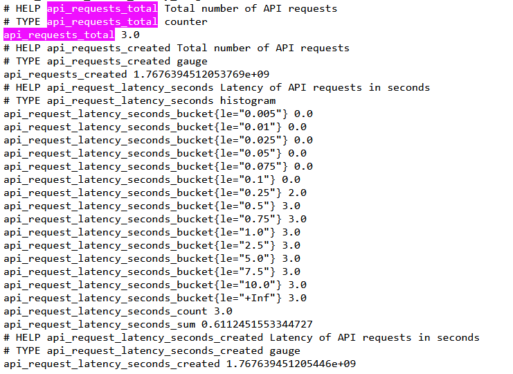

Un histogramme est plus utile qu’une moyenne car la moyenne masque les cas rares mais critiques comme les pics de latence.  
Avec les buckets, on peut estimer des percentiles et détecter une dégradation du “tail latency”, ce qui est souvent le vrai problème en production.  
Cela permet aussi de voir l’évolution de la distribution dans le temps, pas uniquement une valeur unique.

# Exercice 3 : Exploration de Prometheus (Targets, Scrapes, PromQL)

**Status → Targets montrant la target de l’API en UP**

PromQL **Up**

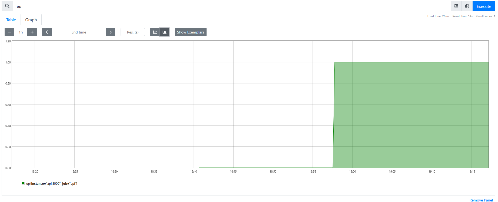

PromQL **api_requests_total**

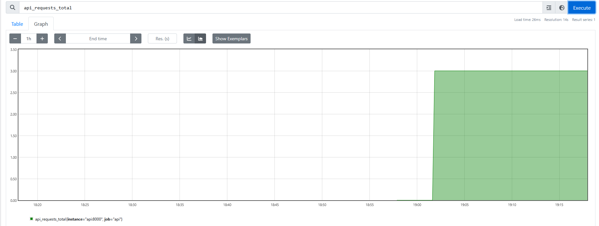

PromQL **rate(api_requests_total[5m])**

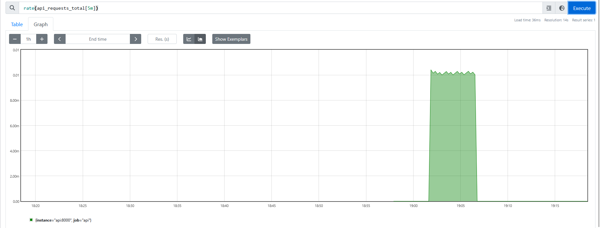

PromQL **rate(api_request_latency_seconds_sum[5m]) / rate(api_request_latency_seconds_count[5m])**

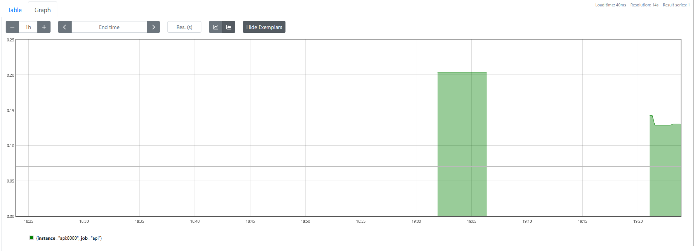

Cette valeur représente la latence moyenne des requêtes API sur une fenêtre glissante de 5 minutes, calculée à partir de l’histogramme Prometheus.

# Exercice 4 : Setup de Grafana Setup et création d'un dashboard minimal

**RPS**

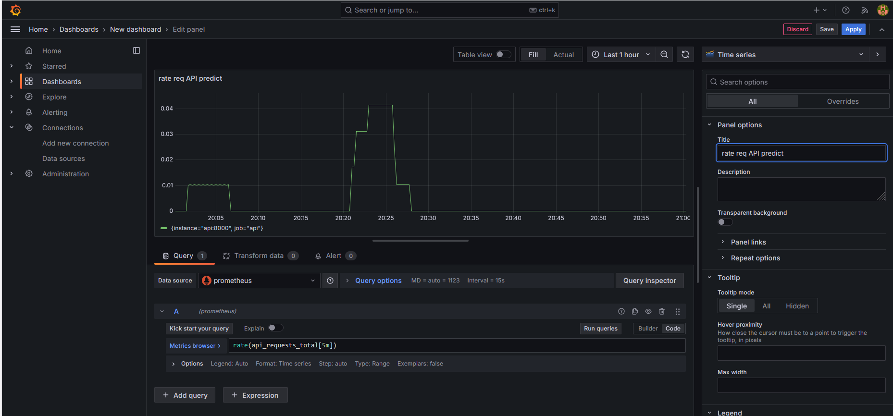

**latence de l’API**

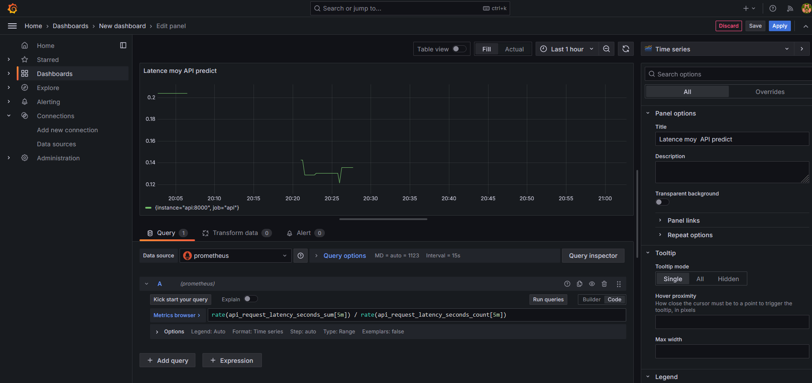

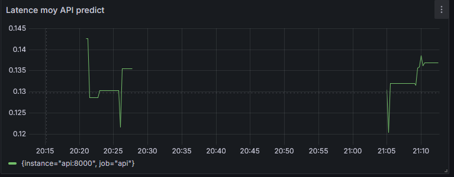 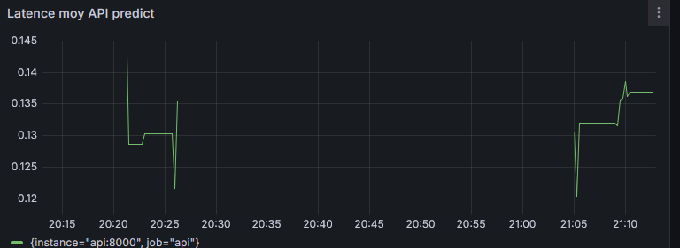

Le dashboard Grafana permet d’observer la charge et la performance de l’API en temps réel. Le panel RPS détecte immédiatement une hausse ou une chute de trafic. Le panel de latence met en évidence des ralentissements par exemple dépendance Feast/MLflow plus lente.
En revanche, ces métriques ne disent rien sur la qualité du modèle comme la précision dont une API peut répondre vite tout en produisant des prédictions mauvaises.
Elles ne détectent pas non plus directement les problèmes de données (features obsolètes, distribution qui change), sauf si cela provoque des erreurs ou des temps de réponse anormaux. Pour surveiller la performance ML, il faut compléter avec des métriques de qualité.

# Exercice 5 : Drift Detection with Evidently (Month_000 vs Month_001)

**Capture d’écran du rapport Evidently (HTML) et comparaison ref vs current**

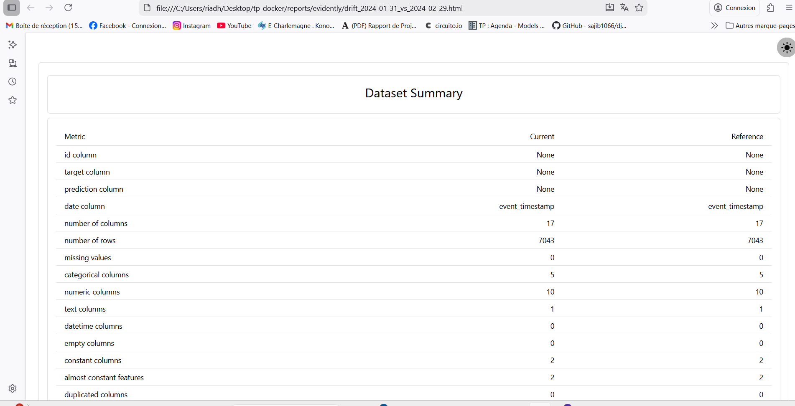

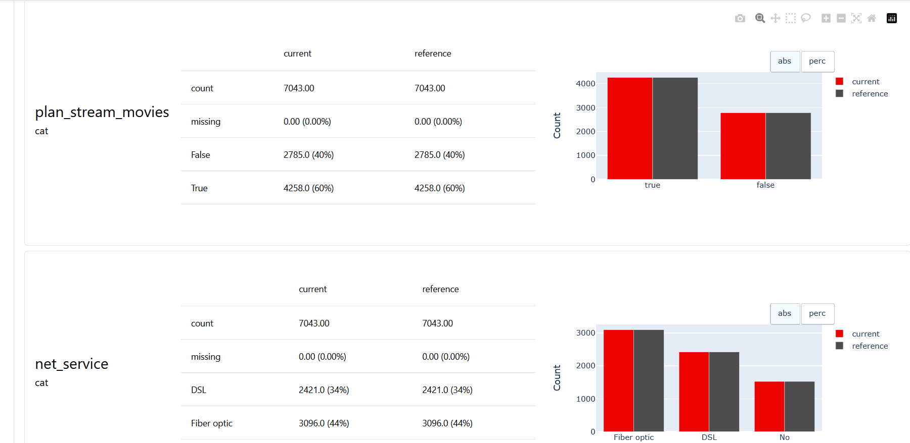

Différence entre “covariate drift” et “target drift” :

- Covariate drift : changement dans la distribution des features (ex: watch_hours_30d, net_service…) entre month_000 et month_001.
- Target drift : changement dans la distribution de la cible (churn_label) par exemple si le taux de churn varie d’un mois à l’autre.

Dans notre cas : covariate drift faible (drift_share = 0.06) et target drift nul.

**Décision finale imprimée par le scrip**

[Evidently] report_html=/reports/evidently/drift_2024-01-31_vs_2024-02-29.html report_json=/reports/evidently/drift_2024-01-31_vs_2024-02-29.json drift_share=0.06 -> NO_ACTION drift_share=0.06 < 0.30 (target_drift=0.0)