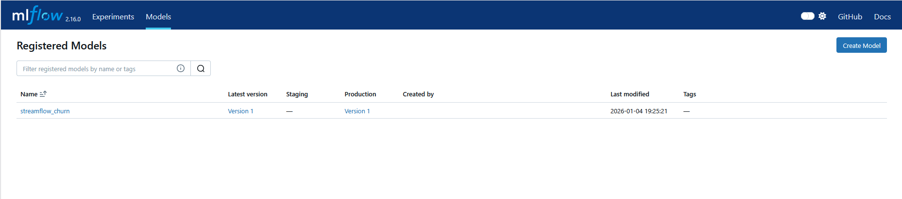
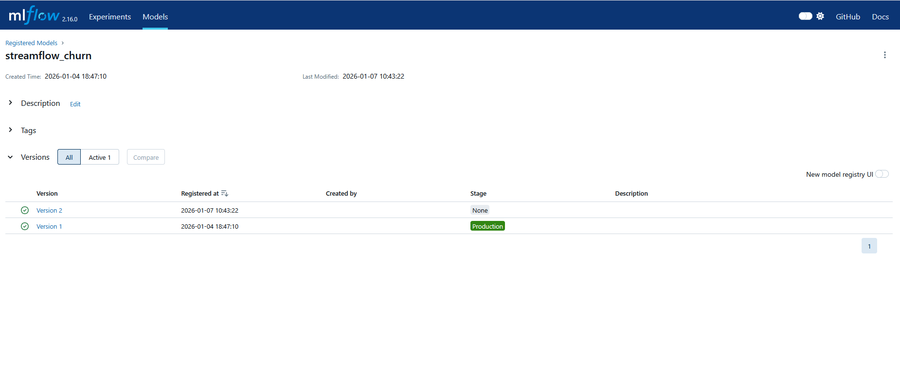
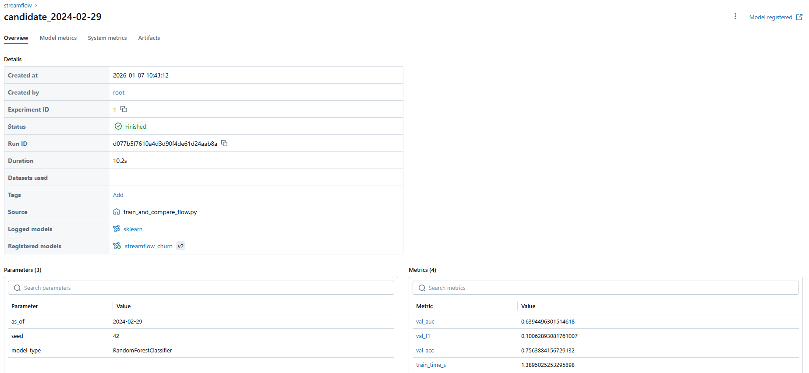
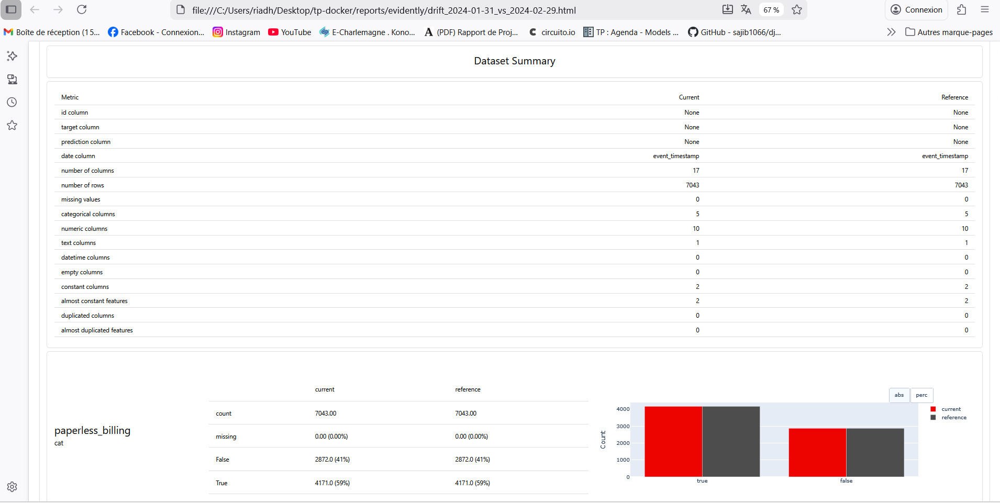
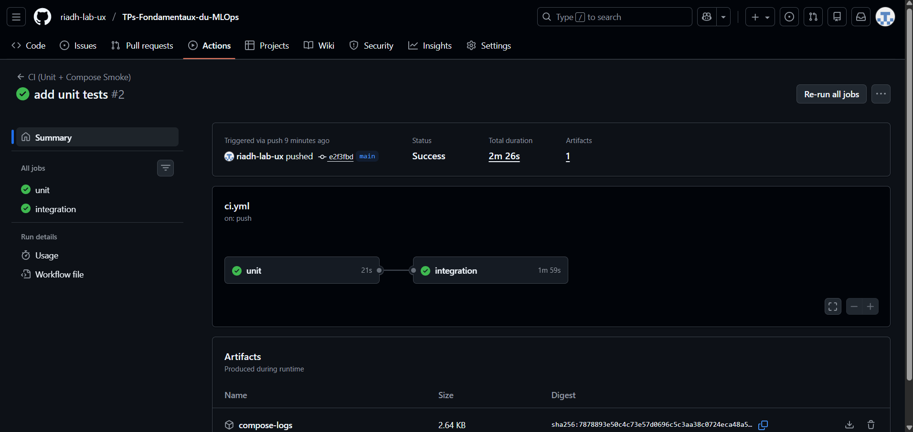

# Exercice 1 : Mise en place du rapport et vérifications de départ

**docker compose up -d**
```
[+] Running 7/7
 ✔ Container tp-docker-mlflow-1     Started                                                                                                0.8s 
 ✔ Container tp-docker-postgres-1   Started                                                                                                0.8s 
 ✔ Container tp-docker-feast-1      Started                                                                                                0.3s 
 ✔ Container tp-docker-prefect-1    Started                                                                                                0.4s 
 ✔ Container tp-docker-api-1        Started                                                                                                0.4s 
 ✔ Container streamflow-prometheus  Started                                                                                                0.4s 
 ✔ Container streamflow-grafana     Started                                                                                                0.4s 

```

**docker compose ps**
```
NAME                    IMAGE                           COMMAND                  SERVICE      CREATED        STATUS          PORTS
streamflow-grafana      grafana/grafana:11.2.0          "/run.sh"                grafana      38 hours ago   Up 26 seconds   0.0.0.0:3000->3000/tcp, [::]:3000->3000/tcp
streamflow-prometheus   prom/prometheus:v2.55.1         "/bin/prometheus --c…"   prometheus   38 hours ago   Up 27 seconds   0.0.0.0:9090->9090/tcp, [::]:9090->9090/tcp
tp-docker-api-1         tp-docker-api                   "uvicorn app:app --h…"   api          38 hours ago   Up 27 seconds   0.0.0.0:8000->8000/tcp, [::]:8000->8000/tcp
tp-docker-feast-1       tp-docker-feast                 "bash -lc 'tail -f /…"   feast        38 hours ago   Up 27 seconds
tp-docker-mlflow-1      ghcr.io/mlflow/mlflow:v2.16.0   "mlflow server --bac…"   mlflow       2 days ago     Up 28 seconds   0.0.0.0:5000->5000/tcp, [::]:5000->5000/tcp
tp-docker-postgres-1    postgres:16                     "docker-entrypoint.s…"   postgres     2 days ago     Up 28 seconds   0.0.0.0:5432->5432/tcp, [::]:5432->5432/tcp
tp-docker-prefect-1     tp-docker-prefect               "/usr/bin/tini -g --…"   prefect      38 hours ago   Up 27 seconds   0.0.0.0:4200->4200/tcp, [::]:4200->4200/tcp

```

**Capture MLflow**



# Exercice 2 : Ajouter une logique de décision testable (unit test)

**pytest -q**
```
..                                                                                                                                       [100%]
2 passed in 0.10s

```

On extrait une fonction pure car elle ne dépend ni de Prefect, ni de MLflow, ni d’un service externe et elle est déterministe, rapide à tester, et permet d’avoir des 

tests unitaires stables.

# Exercice 3 : Créer le flow Prefect train_and_compare_flow (train → eval → compare → promote)

**Capture MLflow**





**transcript des logs du flow**

```

[COMPARE] candidate_auc=0.6394 vs prod_auc=0.9452 (delta=0.0100)
[DECISION] skipped
09:43:26.144 | INFO    | Task run 'compare_and_promote-d59' - Finished in state Completed()
[SUMMARY] as_of=2024-02-29 cand_v=2 cand_auc=0.6394 prod_v=1 prod_auc=0.9452 -> skipped

```

Le delta impose un gain minimal avant promotion dont ça évite de remplacer le modèle production pour des variations dues au hasard, donc on ne promeut que si 

l’amélioration est significative.


# Exercice 4 : Connecter drift → retraining automatique (monitor_flow.py)

**Capture du rapport Evidently HTML**



**Extrait de logs** 

```

10:07:44.547 | INFO    | Task run 'evaluate_production-8cc' - Finished in state Completed()
[COMPARE] candidate_auc=0.6394 vs prod_auc=0.9452 (delta=0.0100)
[DECISION] skipped
10:07:44.608 | INFO    | Task run 'compare_and_promote-343' - Finished in state Completed()
[SUMMARY] as_of=2024-02-29 cand_v=3 cand_auc=0.6394 prod_v=1 prod_auc=0.9452 -> skipped
10:07:44.677 | INFO    | Flow run 'shrewd-skua' - Finished in state Completed()
10:07:44.684 | INFO    | Task run 'decide_action-38b' - Finished in state Completed()
[Evidently] report_html=/reports/evidently/drift_2024-01-31_vs_2024-02-29.html report_json=/reports/evidently/drift_2024-01-31_vs_2024-02-29.json drift_share=0.06 -> RETRAINING_TRIGGERED drift_share=0.06 >= 0.02 (target_drift=0.0) -> skipped


```


# Exercice 5 : Redémarrage API pour charger le nouveau modèle Production + test /predict

**"user_id":3413-BMNZE** 

```

PS C:\Users\riadh\Desktop\tp-docker> Invoke-RestMethod -Method Post `
>>   -Uri "http://localhost:8000/predict" `
>>   -ContentType "application/json" `
>>   -Body '{"user_id":"3413-BMNZE"}' | ConvertTo-Json -Depth 10

```

```
{
    "user_id":  "3413-BMNZE",
    "prediction":  0,
    "features_used":  {
                          "monthly_fee":  45.25,
                          "plan_stream_movies":  false,
                          "net_service":  "DSL",
                          "plan_stream_tv":  false,
                          "paperless_billing":  false,
                          "months_active":  1,
                          "skips_7d":  6,
                          "avg_session_mins_7d":  29.14104461669922,
                          "watch_hours_30d":  32.09199142456055,
                          "unique_devices_30d":  3,
                          "rebuffer_events_7d":  3,
                          "failed_payments_90d":  0,
                          "support_tickets_90d":  0,
                          "ticket_avg_resolution_hrs_90d":  5.800000190734863
                      }
}
```

L’API charge le modèle MLflow au démarrage via le model streamflow_churn/Production et le garde en mémoire. Après une promotion dans le Model Registry, l’API ne 

recharge pas automatiquement la nouvelle version , il faut donc redémarrer le service pour qu’il relance mlflow.pyfunc.load_model et prenne en compte la version 

Production màj.


# Exercice 6 : CI GitHub Actions (smoke + unit) avec Docker Compose

**Capture github Actions** 

Une pipeline CI a été mise en place avec GitHub Actions comprenant les deux jobs `unit` et `integration` et la CI s’exécute automatiquement à chaque push sur la branche.




On démarre Docker Compose dans la CI afin de valider les tests d’intégration multi-services, en vérifiant que l’API fonctionne correctement lorsqu’elle est déployée

avec ses dépendances réelles (PostgreSQL, MLflow, Feast), et pas uniquement via des tests unitaires isolés.

# Exercice 7 : Synthèse finale : boucle complète drift → retrain → promotion → serving

### Synthèse

Dans ce projet, le drift des données est mesuré à l’aide d’Evidently en comparant deux périodes temporelles (month_000 et month_001). 

Evidently calcule un drift_share, qui représente la proportion de variables dont la distribution a significativement changé entre les deux périodes. 

Un seuil de déclenchement est appliqué (0.02) : si la part de variables driftées dépasse ce seuil, le système considère que le modèle risque de devenir obsolète et 

déclenche automatiquement un réentraînement. En pratique, ce seuil serait plus élevé et calibré empiriquement afin d’éviter des réentraînements trop fréquents.

Lorsque le drift dépasse le seuil, le flow `train_and_compare_flow` est exécuté. Ce flow entraîne un modèle candidat sur les données récentes, évalue sa performance via

la métrique val_auc, puis évalue le modèle actuellement en Production sur le même jeu de validation. 
La décision de promotion repose sur une règle robuste dont le modèle candidat est promu uniquement si son AUC dépasse celle du modèle en production d’au moins un delta 

(0.01). 

Ce delta permet d’éviter les promotions dues à de simples fluctuations statistiques. La promotion est réalisée automatiquement via le MLflow Model Registry, en 

archivant l’ancienne version Production.

La séparation des responsabilités est cmme suit :

- Prefect orchestre les processus métier MLOps : monitoring, réentraînement, évaluation, comparaison et promotion des modèles.

- GitHub Actions assure l CI en validant la qualité du code via des tests unitaires et des tests d’intégration légers basés sur Docker Compose et la CI ne prend aucune 

 décision métier sur les modèles.


### Limites et améliorations possibles

La CI ne doit pas entraîner un modèle complet car l’entraînement est coûteux, long et non déterministe, ce qui rendrait les pipelines CI instables et lents. 

La CI doit rester rapide et reproductible.

Plusieurs tests manquent encore, notamment des tests de schéma des données, des tests de dérive sur des cas synthétiques, et des tests de performance du modèle dans le 

temps.

Enfin, dans un environnement réel, une approbation humaine est souvent nécessaire avant toute promotion en production. Les décisions automatiques doivent être 

complétées par des mécanismes de validation métiers, en particulier pour des modèles ayant un impact business ou réglementaire fort.

